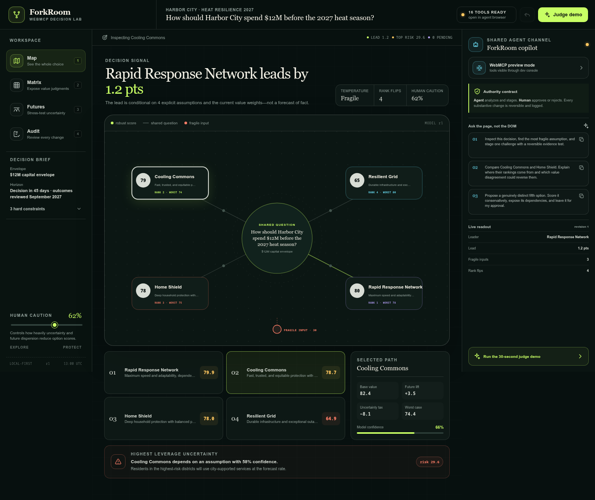
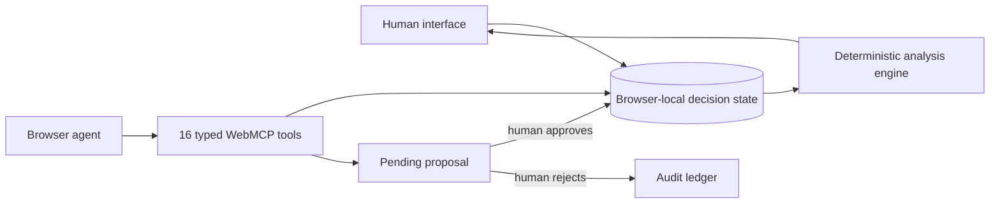
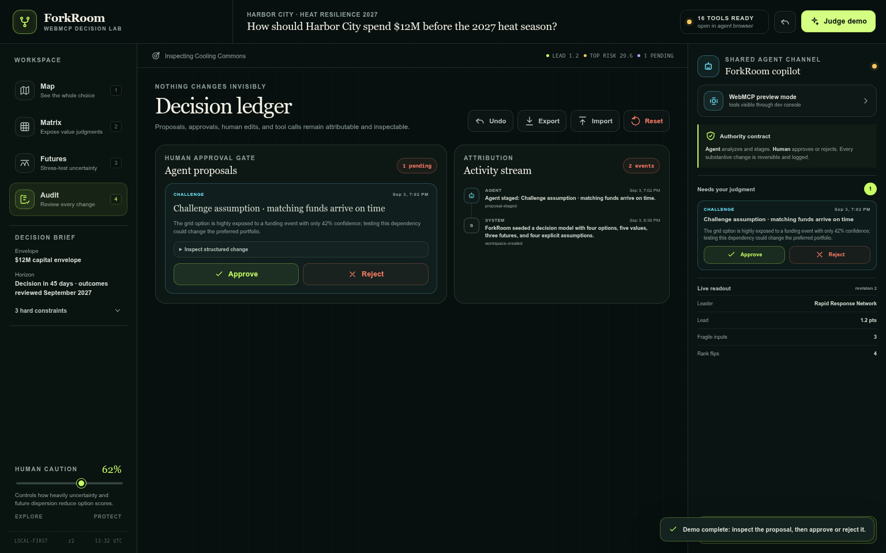

# ForkRoom

> **See the future before you choose it.**
>
> A live decision multiverse where people own values and authority while browser agents expand, challenge, and stress-test the choice through WebMCP.

> [!IMPORTANT]
> This tree is **v1.1.0-post.1**, a post-judging hardening candidate. The frozen WebMCP Challenge entry remains [`v1.0.2`](https://github.com/streetquant/forkroom-webmcp/releases/tag/v1.0.2) at commit `9b42593ac2cb03d645cda5dc1dbb910fd859a0ac`. Do not replace the judged repository, live branch, release, or video during judging.

[](https://github.com/streetquant/forkroom-webmcp/actions/workflows/verify.yml)
[](https://github.com/streetquant/forkroom-webmcp/actions/workflows/publish-live.yml)
[](./LICENSE)
[](./src/webmcp/protocol.ts)

**[Open the self-contained live app](https://htmlpreview.github.io/?https://github.com/streetquant/forkroom-webmcp/blob/live/standalone.html)** · **[CDN fallback](https://raw.githack.com/streetquant/forkroom-webmcp/live/index.html)** · **[Watch the 50-second demo](https://drive.google.com/file/d/1SHYTAq-y0NPZjoi5L30PPboSveiUsm_2/view)** · **[Read the submission](./docs/SUBMISSION.md)**



ForkRoom is an entry for the [OpenAI WebMCP Challenge](https://openai.com/webmcp-challenge/). It is deliberately not “chat beside a dashboard.” The page itself is a shared decision world: the human can directly see and edit values, uncertainty, alternatives, and commitments; the agent receives typed capabilities over the same live state.

## Judge it in 60 seconds

1. Open the **live app** and click **Judge demo**.
2. Watch the agent identify a fragile funding assumption and stage a structured challenge.
3. Open **Audit**. The model has not changed: the proposal is waiting for a person.
4. Inspect the payload, then choose **Approve** or **Reject**.
5. Open the **Protocol lens** to inspect all 16 tools, their modes, and the authority boundary.
6. Move an Equity weight or future probability and see the ranking, regret, downside, and rank-reversal signals recompute immediately.

The demo is seeded with one real-world-shaped question: **How should Harbor City spend a $12M heat-resilience budget before the 2027 season?** Four portfolios compete across five human values, three possible futures, and four explicit assumptions.

## Why WebMCP is essential

A consequential decision is not a one-shot form submission. It is shared, evolving state:

- options and their competing theses;
- human values and weights;
- uncertain assumptions and evidence;
- possible futures and probabilities;
- scores, regret, downside, and sensitivity;
- proposed changes, authority, and commitments.

DOM automation can click controls, but it cannot reliably express the semantic difference between **inspect**, **stress-test**, **navigate**, **stage**, and **approve**. ForkRoom uses imperative WebMCP tools to expose those distinctions directly.



The human interface and the agent tools call the same domain model and reducer. There is no mocked “agent demo” backend and no second source of truth.

## The authority contract

| Capability | Human | Agent |
| --- | :---: | :---: |
| Inspect the live model | ✓ | ✓ |
| Compare options and run counterfactuals | ✓ | ✓ |
| Navigate the visible workspace | ✓ | ✓ |
| Change weights, scores, or probabilities directly | ✓ | — |
| Stage a structured model change | ✓ | ✓ |
| Approve or reject an agent proposal | **✓** | **never** |
| Make the final commitment | **✓** | proposal only |

This boundary exists in code, not merely in interface copy. No registered WebMCP tool can approve a proposal. Every substantive agent-authored mutation returns a proposal ID and remains outside the model until a visible human action admits it.

## 16 narrow WebMCP tools

### Observe and falsify — read-only

| Tool | Decision capability |
| --- | --- |
| `forkroom_inspect_decision` | Read a summary, full model, or derived analysis. |
| `forkroom_inspect_option` | Decompose one option’s value, downside, uncertainty, and regret. |
| `forkroom_compare_options` | Compare two to four options using the live model. |
| `forkroom_find_fragile_assumptions` | Rank uncertainty × impact × exposure. |
| `forkroom_run_stress_test` | Run side-effect-free future/caution counterfactuals. |
| `forkroom_find_rank_reversals` | Find value-weight perturbations that change the leader. |
| `forkroom_find_next_uncertainty` | Select the highest-leverage next deliberation or evidence task. |
| `forkroom_export_snapshot` | Return a versioned JSON-compatible state snapshot. |

### Share attention — presentation only

| Tool | Decision capability |
| --- | --- |
| `forkroom_focus_view` | Focus Map, Matrix, Futures, or Audit and optionally select an option. |

### Stage, never smuggle — human approval required

| Tool | Decision capability |
| --- | --- |
| `forkroom_propose_option` | Add a genuinely distinct alternative for review. |
| `forkroom_propose_criterion` | Add a missing human value with a provisional weight. |
| `forkroom_propose_assumption` | Make a hidden dependency explicit and falsifiable. |
| `forkroom_propose_future` | Add a materially different possible future. |
| `forkroom_propose_score_change` | Revise one option-by-criterion judgment with evidence. |
| `forkroom_challenge_assumption` | Stage a counterexample, revised confidence, and evidence test. |
| `forkroom_draft_commitment` | Draft a reversible commitment with guardrails and review trigger. |

All input schemas are closed at the root, strings and arrays are bounded, referenced IDs are checked against current state, execution is abortable, read tools declare `readOnlyHint`, and workspace content is marked untrusted.

### Post-judging hardening candidate

The isolated `v1.1.0-post.1` candidate adds four defenses without changing the 16-tool ontology:

- every proposal tool requires `expected_revision` from a fresh inspection, so stale agent plans are rejected before staging;
- every successful tool result carries an invocation/effect/revision receipt;
- imported and restored snapshots receive deep structural, bounds, uniqueness, and referential validation;
- proposal tools emit the incubator-main `consequentialHint` while retaining the published `readOnlyHint` and `untrustedContentHint` behavior.

These changes are packaged separately from the frozen competition entry. See [`docs/POST_JUDGING_HARDENING.md`](./docs/POST_JUDGING_HARDENING.md).

## Decision model

For option \(i\), criterion \(j\), future \(s\), and assumption \(a\):

\[
B_i = \sum_j w_j x_{ij}, \qquad
M_i = \sum_s p_s m_{is}
\]

\[
A_i = \sum_a (1-c_a)q_a|e_{ia}|, \qquad
R_i = \operatorname{clamp}\bigl(B_i + M_i - \rho(A_i + 0.75\sigma_i), 0, 100\bigr)
\]

- \(w_j\): normalized human criterion weight;
- \(x_{ij}\): option score, direction-normalized to `[0,100]`;
- \(p_s\): normalized future probability;
- \(m_{is}\): future-specific score impact;
- \(c_a\): confidence in an assumption;
- \(q_a\): decision impact if the assumption is wrong;
- \(e_{ia}\): option exposure to the assumption;
- \(\sigma_i\): dispersion of future impacts;
- \(\rho\): the human-controlled caution level.

ForkRoom also reports worst-case score, regret, confidence, fragile assumptions, and rank reversals. These are **structured decision aids**, not causal estimates or factual forecasts. The interface states that boundary wherever a score could otherwise be mistaken for truth.

## Product surface

| View | What the human and agent learn together |
| --- | --- |
| **Map** | The whole choice, current leader, model temperature, and highest-leverage uncertainty. |
| **Matrix** | Which value judgments generate the ranking; every weight and score remains human-editable. |
| **Futures** | Which options survive different futures and where value changes flip the leader. |
| **Audit** | Pending proposals, approvals, rejections, tool activity, commitments, import/export, and undo. |



The interface is responsive down to mobile widths, keyboard navigable, reduced-motion aware, local-first, and usable without an API key or account.

## Verification evidence

The current release is gated by two independent GitHub Actions workflows.

**Verify ForkRoom** checks:

- exact dependency installation;
- a static WebMCP contract audit;
- lint with zero warnings;
- 35 deterministic unit/integration tests across analysis, reducer, snapshot validation, protocol, and product behavior;
- production TypeScript and Vite build;
- production entry points and bundled `registerTool` implementation.

**Publish live judge build** repeats the complete verification suite, creates both a portable multi-file app and a self-contained HTML artifact, parses the embedded JavaScript, boots the standalone artifact in JSDOM, asserts the interface rendered, discovers exactly 16 tools, and only then publishes an immutable `live` branch with a `SOURCE_COMMIT` receipt.

See [`docs/VERIFICATION.md`](./docs/VERIFICATION.md) for the invariants and current evidence, and [`docs/ADVERSARIAL_REVIEW.md`](./docs/ADVERSARIAL_REVIEW.md) for failures found and corrected during the build.

## Run locally

```bash
git clone https://github.com/streetquant/forkroom-webmcp.git
cd forkroom-webmcp
npm ci
npm run check
npm run dev
```

Open the displayed local URL. In any browser, the identical development inspection surface is available at:

```js
window.__FORKROOM_DEVTOOLS__.listTools()
await window.__FORKROOM_DEVTOOLS__.execute('forkroom_inspect_decision', {
  detail: 'analysis',
})
```

In a WebMCP-capable browser, the page prefers `document.modelContext.registerTool(...)` and falls back to the deprecated `navigator.modelContext` location used by earlier challenge-browser builds.

To build the self-contained judge artifact:

```bash
VITE_BASE_PATH=./ npm run build
node scripts/build-standalone.mjs
node scripts/smoke-standalone.mjs
```

## Repository map

```text
src/domain/                 Decision ontology, reducer, scoring, sensitivity
src/webmcp/protocol.ts      Schemas, runtime validation, handlers, registration
src/components/             Decision views and collaboration/approval interface
scripts/validate-webmcp.mjs Static protocol and authority-boundary audit
scripts/build-standalone.mjs Reproducible single-file judge artifact
scripts/smoke-standalone.mjs Executable standalone boot and tool-discovery gate
docs/                       Architecture, security, demo, review, and submission
.github/workflows/          Verification and verified-live publication
public/.well-known/         Judge-readable WebMCP catalogue
```

## Honest limitations

- Option scores and future probabilities are human judgments unless backed by separately supplied evidence.
- The sensitivity test perturbs one criterion at a time; it does not exhaust the full joint weight simplex.
- Browser-local storage is appropriate for this challenge demonstration, not confidential production deliberations on a shared preview origin.
- The experimental WebMCP API requires a supporting browser. The development inspector exists for deterministic testing, not as a substitute protocol.
- A production team deployment should use a dedicated origin, authenticated workspaces, role-based approval, and durable collaborative storage.

## Documentation

- [Architecture and invariants](./docs/ARCHITECTURE.md)
- [Security and trust boundaries](./docs/SECURITY.md)
- [Adversarial review](./docs/ADVERSARIAL_REVIEW.md)
- [Verification evidence](./docs/VERIFICATION.md)
- [Demo script and judge prompts](./docs/DEMO_SCRIPT.md)
- [Paste-ready challenge submission](./docs/SUBMISSION.md)
- [Execution plan and analytical contract](./PLAN.md)

## License

MIT © 2026 Shayan Banerjee
