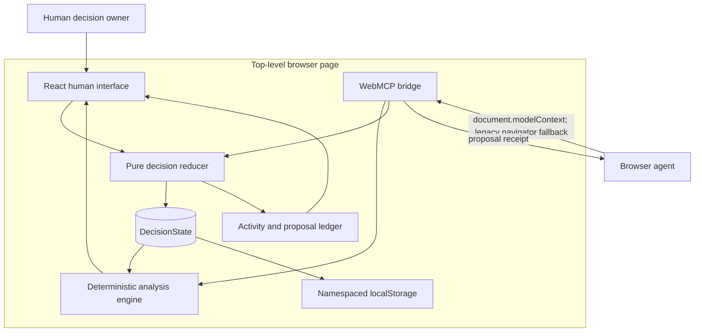
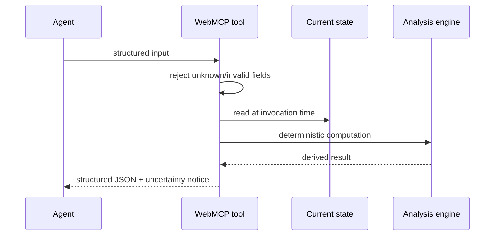
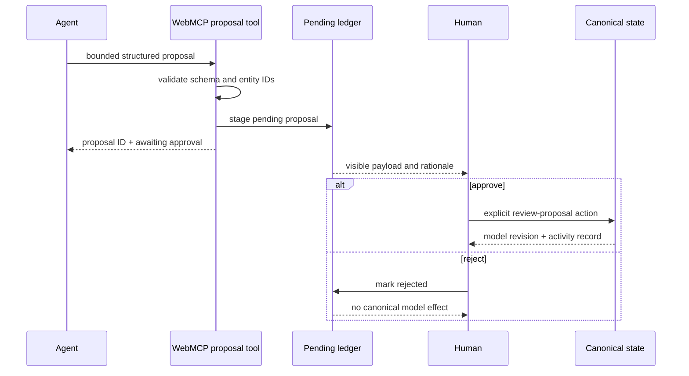

# ForkRoom architecture

## 1. Objective

ForkRoom improves decisions whose quality depends on both human judgment and agent-scale exploration.

The design target is not autonomous optimization. It is a controlled collaboration loop:

\[
\text{human values}
\rightarrow
\text{shared model}
\rightarrow
\text{agent analysis/challenge}
\rightarrow
\text{human review}
\rightarrow
\text{revised model or commitment}.
\]

The human remains the authority over normative inputs and irreversible action. The agent is given high-leverage semantic capabilities over the exact state visible in the page.

## 2. System ontology

The browser-local decision world is:

\[
O=(\text{options},\text{criteria},\text{futures},\text{assumptions},\text{proposals},\text{commitment},\text{activity}).
\]

### Objects

- **Decision**: question, context, horizon, budget, and hard constraints.
- **Option**: a candidate intervention, thesis, criterion scores, future impacts, and assumption exposures.
- **Criterion**: a human value with an operational description, direction, and weight.
- **Future**: a possible state of the world with a probability and severity.
- **Assumption**: a falsifiable dependency with confidence, impact, evidence, and option exposure.
- **Proposal**: an agent- or human-authored candidate mutation outside canonical model state until review.
- **Commitment**: a selected option, decision statement, guardrails, and review trigger.
- **Activity**: attributable human, agent, or system event.

### Transformations

- Human direct edits: weights, scores, future probabilities, uncertainty caution, navigation, approval, rejection, reset, import, and undo.
- Agent read transformations: inspect, compare, stress-test, rank fragility, rank reversals, and select the next uncertainty.
- Agent proposal transformations: stage an option, value, future, assumption, score change, challenge, or commitment.
- Human review transformations: approve a pending proposal into canonical state or reject it without effect.

## 3. Component map

## 4. Source architecture

### `src/domain/types.ts`

Defines all persisted entities, derived analysis values, actions, proposal types, tool invocation records, and view identifiers. There is one versioned root state type: `DecisionState` with `schemaVersion: 1`.

### `src/domain/demo.ts`

Creates a deterministic, structured-clone-safe Harbor City seed model. It contains no network dependencies and no hidden server state.

### `src/domain/analysis.ts`

Implements:

- weight and probability normalization;
- direction-aware criterion scoring;
- probability-weighted future impact;
- uncertainty/exposure penalty;
- future-impact dispersion;
- robust and worst-case scores;
- ranking and regret;
- assumption fragility;
- one-at-a-time criterion sensitivity and rank reversals;
- a compact decision-temperature diagnostic.

The analysis engine does not mutate source state. A fixed `generatedAt` value makes its output deterministic for verification.

### `src/domain/reducer.ts`

Owns canonical state transitions. It:

- clamps every numeric edit to declared bounds;
- renormalizes competing weights and probabilities;
- stages proposals without applying them;
- applies proposal payloads only during `review-proposal: approved`;
- rejects proposals without model mutation;
- records attribution and revision changes;
- performs conservative structural validation for imported snapshots.

The reducer is the shared effect boundary for both human UI actions and agent-generated proposals.

### `src/webmcp/protocol.ts`

Builds the imperative WebMCP surface.

Each tool has:

- a stable, compact name;
- a task-oriented description;
- a closed JSON Schema;
- independent runtime validation;
- an explicit mode: `read`, `navigation`, or `proposal`;
- annotations for read-only and untrusted-content behavior;
- an abort-aware execution wrapper;
- an invocation receipt for the visible audit rail.

The protocol adapter never embeds user-authored workspace content into tool metadata. Dynamic state is read only after invocation.

### `src/App.tsx`

Coordinates browser lifecycle:

- initializes from versioned local storage or the seed model;
- maintains a stable `stateRef` so WebMCP handlers read current state rather than a registration-time closure;
- records bounded in-memory undo history;
- persists state after changes;
- registers/unregisters tools with an `AbortController`;
- exposes an identical development inspection surface;
- runs the guided demonstration;
- owns import/export and notifications.

### `src/components/`

The human surface is intentionally richer than a chat transcript:

- `DecisionViews.tsx`: decision constellation, editable value matrix, future survival chart, sensitivity and fragility diagnostics.
- `Collaboration.tsx`: agent rail, prompt examples, proposal cards, authority contract, audit ledger, protocol lens.
- `Icon.tsx`: dependency-free inline visual language.

## 5. State and authority flow

### Read-only tool

### Proposal tool

### Invariant

For any proposal tool invocation `p`:

\[
\operatorname{canonicalState}(t^+) = \operatorname{canonicalState}(t^-)
\]

until a distinct human `review-proposal(approved)` event occurs.

No WebMCP definition exposes that review action.

## 6. Analytical model

Let:

- \(w_j\ge 0\) be a normalized criterion weight;
- \(x_{ij}\in[0,100]\) be option \(i\)'s direction-normalized score for criterion \(j\);
- \(p_s\ge0\) be a normalized future probability;
- \(m_{is}\in[-40,40]\) be the impact of future \(s\) on option \(i\);
- \(c_a\in[0,1]\) be confidence in assumption \(a\);
- \(q_a\in[0,1]\) be the impact of assumption \(a\) being wrong;
- \(e_{ia}\in[0,1]\) be option \(i\)'s exposure;
- \(\rho\in[0,1]\) be human caution toward uncertainty.

Base value:

\[
B_i=\sum_jw_jx_{ij}.
\]

Expected future adjustment:

\[
M_i=\sum_sp_sm_{is}.
\]

Scaled assumption penalty:

\[
A_i=18\sum_a(1-c_a)q_a|e_{ia}|.
\]

Future dispersion:

\[
\sigma_i=\sqrt{\sum_sp_s(m_{is}-M_i)^2}.
\]

Displayed robust score:

\[
R_i=\operatorname{clamp}\left(B_i+M_i-\rho(A_i+0.75\sigma_i),0,100\right).
\]

The constants `18` and `0.75` are transparent product-scale parameters, not learned coefficients. The model is interpretable by construction and deliberately exposes its dependence on judgments.

### Sensitivity

For each criterion, ForkRoom perturbs its raw weight by `+15` and `−15`, renormalizes the full weight vector, recomputes the ranking, and records any winner change. This is a practical local sensitivity screen. It is not an exhaustive global robustness proof.

## 7. Persistence and recovery

- Canonical state is stored under the namespaced key `forkroom:webmcp:decision:v1`.
- The persisted object carries `schemaVersion: 1`.
- Import performs a conservative structural gate before loading.
- Export produces the complete versioned state.
- Up to 50 previous model states are held for session undo.
- Reset is confirm-gated and itself undoable.
- A blocked or exhausted storage area cannot crash the workspace.

No account, backend, API key, tracking pixel, or external data request is required for the core decision loop.

## 8. Build and deployment architecture

### Normal build

`npm run build` performs TypeScript project compilation and Vite production bundling.

### Contract audit

`scripts/validate-webmcp.mjs` statically checks the expected tool count and taxonomy, unique compact names, `registerTool` use, closed schemas, annotations, human-approval receipt, absence of an agent self-approval tool, abortable registration, type declarations, and license.

### Standalone build

`scripts/build-standalone.mjs`:

1. reads Vite's production entry point;
2. resolves the generated CSS and JavaScript assets;
3. inlines both without replacement-string interpolation hazards;
4. places JavaScript after the application root;
5. rejects duplicate HTML documents;
6. parses the embedded JavaScript with Node's VM parser;
7. verifies that the WebMCP surface remains present;
8. emits `dist/standalone.html`.

### Runtime smoke gate

`scripts/smoke-standalone.mjs` boots the single-file artifact in JSDOM and requires:

- the application shell;
- the decision map;
- exactly 16 discoverable tools;
- both inspection and commitment endpoints;
- zero runtime errors.

### Live branch

The publication workflow repeats the entire audit, lint, test, build, standalone, and runtime-smoke sequence. Only a passing artifact is force-published to the orphan `live` branch. `SOURCE_COMMIT` binds deployed bytes to the main-branch source revision.

## 9. Performance posture

- No runtime component library, graph library, chart library, schema-validation package, state manager, backend SDK, or analytics package is shipped.
- SVG charts and decision maps are generated directly from state.
- The normal production JavaScript bundle is approximately 276 kB before gzip and approximately 84 kB after gzip in the current verified build.
- The application is usable offline after its assets load.
- Analysis is bounded by the small explicit model and recomputed synchronously for immediate feedback.

## 10. Extension boundaries

A production collaborative edition would add, without changing the domain contract:

- authenticated workspaces and role-based approval;
- durable event storage and server-side revision checks;
- evidence attachments with provenance;
- multi-stakeholder value vectors and disagreement views;
- signed decision receipts;
- confidential dedicated-origin hosting;
- optional organization-specific tool exposure.

The challenge version deliberately keeps deployment local-first so the WebMCP and authority design can be judged without credentials, infrastructure, or simulated external services.
